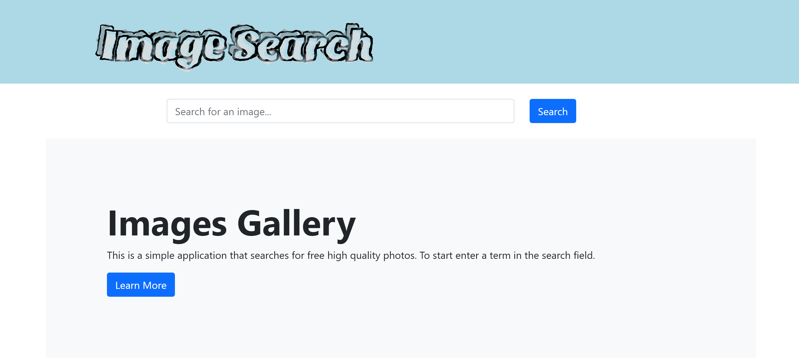
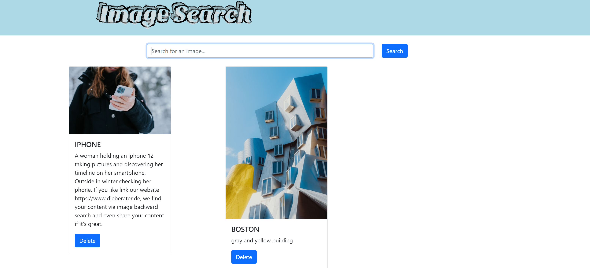

# Image Search App

## Build instructions
1. Clone repo
2. docker-compose up
* Enter docker-compose config if nothing starts
4. View app at http://localhost:3000

## Future Steps
1. Integrate MongoDB to save pictures/persistent volume
2. Deploy code on AWS

## Screenshots
 

